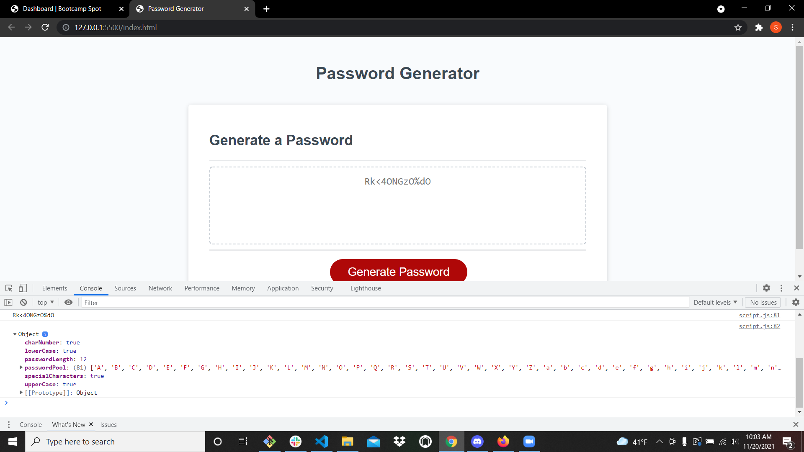

# PasswordGenerator
The goal was to create a funtion to create a password with requirments to display to a user.

# How I went about it
The first thing was to build the variables that would store our character pools and password
For the function I started off by getting a desired length and placed logic to restrict passwordLength between 8 and 128
The user is prompted to include each character pool, if the user confirms the options a character from the pool is added to the password.
If any requirements are not accepted the user is alerted and the function fails
If all requirements were met the rest of the password is completed and displayed to the user

# Look at how pretty it is!

https://github.com/ShaneWiens/PasswordGenerator

# What I learned
After many hours of banging my head against the wall I reached out to a friend for help. semicolons, I am terrible at placing them in my code and it wreaked havoc on the process. So I've learned to be more mindful of formating.